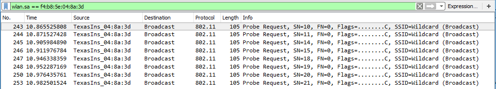

# CC3100 Active Scan

## Used Modules

* Gets the WLAN scan operation results using the following `sl_WlanGetNetworkList` and `sl_WlanPolicySet`

## Output example:

```

 Scan policy application - Version 1.3.0

*******************************************************************************

 Device is configured in default state: 0 

 Device started as STATION 

 Enabling and configuring the scan policy: 10 

MAC Add: 38:1C:1A:C4:31:27, SSID: UniversityGuest, RSSI: -71
MAC Add: 6C:FA:89:C9:47:10, SSID: Innopolis, RSSI: -52
MAC Add: 38:1C:1A:C4:31:23, SSID: UniversityStaff, RSSI: -71
MAC Add: 00:08:2F:32:F3:67, SSID: UniversityGuest, RSSI: -81
MAC Add: 6C:FA:89:C9:47:17, SSID: UniversityGuest, RSSI: -51
MAC Add: 00:08:2F:4A:90:28, SSID: UniversityStudent, RSSI: -68
MAC Add: BC:67:1C:E8:FB:61, SSID: InnoMeeting, RSSI: -75
MAC Add: 00:08:2F:4A:90:20, SSID: Innopolis, RSSI: -68
MAC Add: BC:67:1C:E8:FF:42, SSID: InnopolisU, RSSI: -76
MAC Add: BC:67:1C:E8:FB:67, SSID: UniversityGuest, RSSI: -74
MAC Add: 00:08:2F:4A:90:27, SSID: UniversityGuest, RSSI: -68
MAC Add: 38:1C:1A:C4:35:F0, SSID: Innopolis, RSSI: -70
MAC Add: 58:97:1E:A2:60:B0, SSID: Innopolis, RSSI: -83
MAC Add: 38:1C:1A:79:0F:13, SSID: UniversityStaff, RSSI: -72
MAC Add: 00:08:2F:32:F3:D2, SSID: InnopolisU, RSSI: -50
MAC Add: 62:01:94:15:CE:6B, SSID: ESP_15CE6B, RSSI: -86
MAC Add: 00:08:2F:32:F3:D8, SSID: UniversityStudent, RSSI: -50
MAC Add: 38:1C:1A:C4:35:F7, SSID: UniversityGuest, RSSI: -70
MAC Add: 38:1C:1A:79:0F:17, SSID: UniversityGuest, RSSI: -72
MAC Add: 00:08:2F:32:F3:D7, SSID: UniversityGuest, RSSI: -51
 Scan Process completed 

 Disabled the scan policy
 
 ```

## Ensuring the Active scan with Kali Linux 

* Active scan captures Using the [cc3100Boost+cc31XXEMUBoost - 11](ActiveScan/cc3100-active-monitoring-channel-1.pcapng)
 

  
